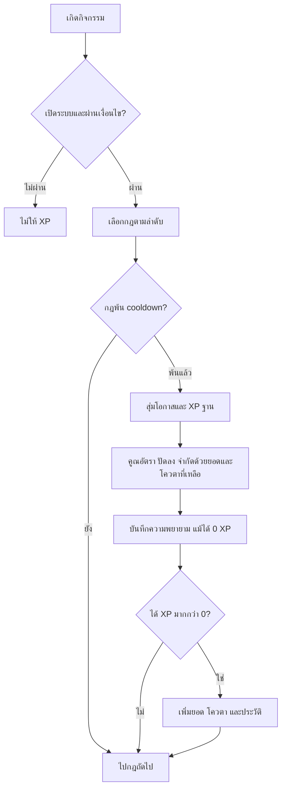

# คู่มือระบบ Levels & XP

เอกสารสำหรับผู้ดูแลเซิร์ฟเวอร์และนักพัฒนา อ้างอิงพฤติกรรมของโค้ดใน branch นี้ ณ 29 กันยายน 2026
ค่าในตารางเป็นข้อกำหนดของ API; ตัวอย่างทั้งหมดใช้ ID สมมติ

## สารบัญ

1. [ภาพรวมและสิทธิ์](#overview)
2. [เริ่มใช้งานผ่าน Dashboard](#dashboard)
3. [การตั้งค่าทั้งเซิร์ฟเวอร์](#settings)
4. [รายละเอียดกฎ XP](#rules)
5. [กิจกรรมที่ให้ XP](#activities)
6. [การคำนวณ โอกาส Cooldown และเพดาน](#calculation)
7. [สูตรเลเวลและอันดับ](#levels)
8. [ตัวอย่างการตั้งค่า](#recipes)
9. [CRUD สมาชิกและประวัติ](#members)
10. [API Reference](#api)
11. [โครงสร้างข้อมูลและการทำงานภายใน](#internals)
12. [Migration และการทดสอบ](#operations)
13. [แก้ปัญหาและข้อจำกัด](#limitations)
14. [แผนที่ไฟล์สำหรับนักพัฒนา](#source-map)

<a id="overview"></a>

## 1. ภาพรวมและสิทธิ์

XP คือคะแนนสะสมต่อ **เซิร์ฟเวอร์และ Discord User ID** สมาชิกคนเดียวกันมี XP แยกกันในแต่ละเซิร์ฟเวอร์
เลเวลคำนวณจาก XP สะสม ส่วนอันดับเรียงตาม XP ภายในเซิร์ฟเวอร์นั้น

ระบบให้ XP อัตโนมัติจาก 3 กิจกรรม: ส่งข้อความ (`message`), อยู่ห้องเสียง (`voice`), ใช้คำสั่งบอท (`command`)
กิจกรรมนอกเหนือจากนี้ให้รางวัลผ่านการเพิ่ม XP โดยผู้ดูแลได้ แต่ยังไม่มีตัวตรวจจับอัตโนมัติ

| ผู้ใช้ Dashboard | ดูอันดับ | ตั้งกฎ/แก้ XP/รีเซ็ต/ดูประวัติ |
| --- | --- | --- |
| สมาชิกในเซิร์ฟเวอร์ที่เชื่อมบัญชี Discord | ได้ | ไม่ได้ |
| เจ้าของเซิร์ฟเวอร์ หรือมี Manage Server / Administrator | ได้ | ได้ |
| ADMIN ของระบบ Dashboard | ได้ในเซิร์ฟเวอร์ที่บอทอยู่ | ได้ในเซิร์ฟเวอร์ที่บอทอยู่ |
| บุคคลภายนอกเซิร์ฟเวอร์ | ไม่ได้ | ไม่ได้ |

API ตรวจสิทธิ์ด้วย `GuildAccessGuard` ทุก endpoint ไม่ได้พึ่งการซ่อนแท็บในหน้าเว็บอย่างเดียว
ผลสิทธิ์สมาชิกมี cache สูงสุด 60 วินาทีและมีกลไกล้างเมื่อข้อมูลสมาชิกเปลี่ยน
เมื่อบอทออฟไลน์ สมาชิกทั่วไปตรวจสิทธิ์ไม่ได้; ADMIN ยังจัดการข้อมูลที่เก็บไว้ได้หากทะเบียนเซิร์ฟเวอร์ระบุว่าบอทยังไม่ออก
การค้นหาชื่อและรายการจาก Discord ยังขึ้นกับความพร้อมของบอท

<a id="dashboard"></a>

## 2. เริ่มใช้งานผ่าน Dashboard

เปิด **Servers → เลือกเซิร์ฟเวอร์ → Levels & XP** (`/servers/:guildId/levels`)

| แท็บ | ใช้ทำอะไร |
| --- | --- |
| อันดับสมาชิก | ดู XP/เลเวล/ความคืบหน้า ค้นหาชื่อขึ้นต้นหรือ ID ดูอันดับตัวเอง และเปลี่ยนหน้า |
| กฎและอัตรา XP | เปิดระบบ ตั้งค่ารวม สูตรเลเวล และ CRUD กฎกิจกรรม |
| จัดการสมาชิก | เพิ่ม/ลด/กำหนด/รีเซ็ต/ลบ XP รายคน และรีเซ็ตทั้งเซิร์ฟเวอร์ |
| ประวัติ | ตรวจรายการได้รับ XP และรายการแก้ไข พร้อมกรองสมาชิกและเปลี่ยนหน้า |

### ตั้งค่าครั้งแรก

1. เปิดแท็บ **กฎและอัตรา XP** แล้วเปิด **เปิดรับ XP จากกิจกรรม**
2. เลือกกฎข้อความหรือเสียงที่มีอยู่ หรือกด **เพิ่มกฎ** ของกิจกรรมที่ต้องการ
3. กำหนด XP ต่ำสุด/สูงสุดต่อครั้ง ถ้าต้องการจำนวนคงที่ให้ตั้งสองช่องเท่ากัน
4. ตั้งตัวคูณ โอกาส Cooldown เพดาน และห้อง/ยศที่มีสิทธิ์
5. ตรวจตัวอย่าง XP แล้วกด **บันทึกทั้งหมด**

การแก้กฎเป็นฉบับร่างจนกว่าจะบันทึก รวมทั้งเพิ่ม ลบ คัดลอก สลับลำดับ และคืนค่าเริ่มต้น
สลับแท็บแล้วยังเก็บร่างการตั้งค่าไว้ และมีการเตือนเมื่อออกจากหน้าขณะยังไม่บันทึก
ปุ่ม **โหลดใหม่** ดึงค่าล่าสุดจาก API; หากมีร่างจะถามก่อนทิ้งการแก้ไข
การคืนค่าเริ่มต้นแทนที่การตั้งค่าและกฎทั้งชุด แต่ไม่ลบ XP สมาชิก

ในตัวเลือก **ให้เฉพาะห้อง/หมวด** กด **เลือกห้องเสียงทั้งหมด** เพื่อเลือก Voice และ Stage ที่มีตอนนี้ในครั้งเดียว
ปุ่มนี้คงห้องอื่นที่เลือกไว้และไม่ขึ้นกับข้อความค้นหา; **ล้างการเลือก** ล้างรายการห้องของกฎ
ถ้ากฎเสียงไม่เลือกห้องเลย จะครอบคลุมทุกห้องเสียงรวมถึงห้องที่สร้างใหม่อัตโนมัติ (ยังอยู่ภายใต้ exclusion)
การเลือกเป็นรายการจำกัดสูงสุด 100 ID; หากเลือกทั้งหมดแล้วเกิน จะไม่เปลี่ยนรายการและแจ้งให้ทราบ

หากมีผู้ดูแลอีกคนบันทึกก่อน จะพบ HTTP 409 ให้โหลดค่าล่าสุดแล้วนำการแก้ไขของตนไปใส่อีกครั้ง
ระบบไม่รวมร่างของผู้ดูแลสองคนให้อัตโนมัติ

<a id="settings"></a>

## 3. การตั้งค่าทั้งเซิร์ฟเวอร์

ทุก field ใน `settings` ต้องส่งครบเมื่อบันทึก API ไม่มี partial update

| Field | ค่าเริ่มต้น | ค่าที่รับ / ความหมาย |
| --- | --- | --- |
| `enabled` | `true` | Boolean; ปิดแล้วหยุด XP จากกิจกรรม แต่ผู้ดูแลยังแก้ XP ได้ |
| `multiplierPercent` | `100` | Number 0–1,000; ตัวคูณรวม 100 = 1 เท่า, 200 = 2 เท่า |
| `dailyCap` | `0` | Integer 0–2,000,000,000; เพดานกิจกรรมรวมต่อคนต่อวัน; 0 = ไม่กำหนดเพดานเอง |
| `curveBase` | `100` | Integer 1–100,000; ฐานในสูตร XP ที่ต้องมีเพื่อถึงเลเวล |
| `curveExponent` | `2` | Number 1–3; เลขยกกำลังในสูตร รองรับทศนิยม |
| `excludedChannelIds` | `[]` | ห้อง/หมวดที่ไม่ให้ XP อัตโนมัติ สูงสุด 100 ID |
| `excludedRoleIds` | `[]` | มียศใดในรายการนี้จะไม่ได้ XP อัตโนมัติ สูงสุด 100 ID |
| `messageMinLength` | `0` | Integer 0–4,000; ความยาวข้อความขั้นต่ำหลัง trim |
| `voiceIgnoreMuted` | `true` | ข้ามผู้ที่ Discord ระบุ mute หรือ suppress ใน Stage |
| `voiceIgnoreDeafened` | `true` | ข้ามผู้ที่ Discord ระบุ deaf |
| `voiceIgnoreAfk` | `true` | ข้ามผู้ที่อยู่ห้อง AFK ของเซิร์ฟเวอร์ |
| `voiceMinMembers` | `1` | Integer 1–99; จำนวนคนที่ไม่ใช่บอทขั้นต่ำในห้อง รวมตัวผู้รับ |
| `rules` | ข้อความ + เสียง | กฎ 0–50 รายการ และ `id` ต้องไม่ซ้ำกัน |

Discord ID ใน API ใช้ **string** ของตัวเลข 5–25 หลักตาม validator กลางของโปรเจกต์
ไม่ควรแปลง ID เป็น JavaScript Number เพราะอาจสูญเสียความแม่นยำ
รายการห้อง/ยศว่างใน exclusion หมายถึงไม่ยกเว้นใคร
ไม่มีระบบตั้ง timezone ต่อเซิร์ฟเวอร์: วันของโควตาใช้ **Asia/Bangkok (UTC+7)** เสมอ

<a id="rules"></a>

## 4. รายละเอียดกฎ XP

| Field | ค่าที่รับ | ความหมาย |
| --- | --- | --- |
| `id` | String 1–64 ตัว; `a-z`, `A-Z`, `0-9`, `_`, `-` | รหัสกฎและตัวผูก cooldown/โควตารายกฎ |
| `name` | String หลัง trim 1–80 ตัว | ชื่อแสดงและเหตุผลในประวัติ XP อัตโนมัติ |
| `enabled` | Boolean | เปิด/ปิดเฉพาะกฎ |
| `source` | `message`, `voice`, `command` | กิจกรรมที่กระตุ้นกฎ |
| `minXp` | Integer 0–100,000 | XP ฐานต่ำสุด |
| `maxXp` | Integer 0–100,000; ต้อง ≥ `minXp` | XP ฐานสูงสุด สุ่มรวมปลายทั้งสองด้าน |
| `multiplierPercent` | Number 0–1,000 | ตัวคูณของกฎ ใช้คูณกับตัวคูณรวมอีกครั้ง |
| `chancePercent` | Number 0–100 | โอกาสได้ XP ในแต่ละครั้งที่ผ่านเงื่อนไขและ cooldown |
| `cooldownSeconds` | Integer 1–86,400 | เวลาระหว่างความพยายามให้ XP ของกฎเดียวกัน |
| `dailyCap` | Integer 0–2,000,000,000 | เพดานของกฎต่อคนต่อวัน; 0 = ไม่กำหนดเพดานเอง |
| `channelIds` | Array สูงสุด 100 ID | ห้องหรือหมวดที่ให้ XP; ว่าง = ทุกห้อง |
| `roleIds` | Array สูงสุด 100 ID | ต้องมียศใดยศหนึ่ง; ว่าง = ทุกคน |
| `commands` | Array สูงสุด 100 ชื่อ | ใช้กับ `command`; ว่าง = ทุกคำสั่งที่บอทรองรับ |

ชื่อใน `commands` หลัง trim ยาว 1–32 ตัว รับตัวอักษร Unicode ตัวเลข `_` และ `-`
API รับชื่อ **ไม่มี `/`**; ช่อง Dashboard รับ comma-separated และตัด `/` ตัวแรกของแต่ละชื่อให้
การเทียบชื่อเป็น exact match ไม่มี wildcard, regex, subcommand selector หรือแปลงตัวพิมพ์ให้

### กฎเริ่มต้น

| กิจกรรม | ID | XP ฐาน | ตัวคูณ | โอกาส | Cooldown | เพดาน |
| --- | --- | --- | --- | --- | --- | --- |
| ข้อความ | `message` | 15–25 | 100% | 100% | 60 วินาที | 0 |
| เสียง | `voice` | 5–10 | 100% | 100% | 60 วินาที | 0 |

ค่าเริ่มต้นมีสองกฎนี้และเปิดอยู่ ไม่มี command rule จนกว่าจะเพิ่ม
กฎใหม่ที่เพิ่มผ่าน Dashboard เปิดอยู่ทันทีในร่าง ส่วน helper `defaultXpRule('command')` ให้ `enabled: false` เพื่อให้นักพัฒนาเลือกเปิดเอง
กฎคำสั่งเริ่มต้นจาก helper ใช้ XP 15–25 และ cooldown 60 วินาที

### การจับคู่และการซ้อนกฎ

- ต้องตรงทั้ง source, ห้อง และยศ หากกำหนดชื่อคำสั่งก็ต้องตรงด้วย
- หลายห้องภายในรายการใช้ OR; หลายยศใช้ OR; ระหว่างเงื่อนไขห้องกับยศใช้ AND
- การยกเว้นระดับเซิร์ฟเวอร์มีผลก่อนกฎเสมอ กฎเฉพาะยศไม่สามารถฝืน exclusion ได้
- ตรวจ channel ID, parent ID และ category ID ที่มีใน context จึงรองรับห้องลูก/เธรดเมื่อข้อมูล parent พร้อม
- **ทุกกฎที่ตรงจะทำงานเรียงตามรายการ** ไม่ใช่เลือกกฎเดียวหรือเลือกจำนวนที่มากที่สุด
- การเปลี่ยนลำดับมีผลเมื่อโควตารวมเหลือน้อย กฎก่อนหน้าจะใช้โควตาก่อน

การคัดลอกกฎสร้าง ID ใหม่ จึงมี cooldown และโควตารายกฎของตัวเอง และอาจได้รับ XP สองกฎซ้อนกัน
การแก้กฎโดยคง ID เดิมจะใช้ cooldown/ยอดรายวันเดิม แม้เปลี่ยนกิจกรรมหรืออัตรา
การลบกฎไม่ลบ XP หรือประวัติ และไม่ล้าง progress ทันที; ใช้ ID เดิมอีกครั้งอาจกลับมาใช้ progress เดิม

<a id="activities"></a>

## 5. กิจกรรมที่ให้ XP

### 5.1 ข้อความ

ทำงานใน `MessageCreate` หลัง Anti-Spam และตัวกรองคำหยาบ หากขั้นใดหยุดข้อความไว้ก่อนจะไม่มาถึง XP
DM, ผู้ส่งที่เป็นบอท และ webhook ไม่ได้ XP ข้อความ
ตรวจความยาวด้วย `message.content.trim().length` ซึ่งเป็น JavaScript string length ไม่ใช่จำนวนคำหรือจำนวนอักษรที่มองเห็น
ข้อความรูป/ไฟล์อย่างเดียวมี content ว่าง จึงผ่านเงื่อนไขความยาวได้เมื่อ `messageMinLength = 0`
ไม่มีการคิด XP เพิ่มจากจำนวนไฟล์ ความยาวที่มากกว่าขั้นต่ำ หรือคุณภาพเนื้อหา
การแก้ไข/ลบข้อความภายหลังไม่เรียกคำนวณใหม่และไม่ถอน XP ที่ได้รับแล้ว

### 5.2 ห้องเสียง

งานเบื้องหลังตรวจห้อง Voice และ Stage ทุก 15 วินาที แล้วลองให้ XP กับสมาชิกที่อยู่ในห้อง ณ รอบนั้น
มี guard กันรอบงานซ้อนใน process เดียว; หากรอบก่อนยังไม่จบจะข้ามรอบใหม่

- เป็นการตรวจสถานะ ณ เวลานั้น ไม่มีตัววัดว่าอยู่ครบกี่วินาทีจริงหรือกำลังพูดอยู่หรือไม่
- สมาชิกใหม่อาจได้ XP ในรอบตรวจแรกเลย ไม่จำเป็นต้องอยู่ครบ cooldown ก่อนครั้งแรก
- Cooldown ยังจำกัดครั้งถัดไป เช่น ตั้ง 60 วินาทีไม่ได้หมายความว่าได้รับทุก 15 วินาที
- ตั้ง cooldown ต่ำกว่า 15 วินาทีไม่ได้เพิ่มความถี่งานตรวจให้ถี่ขึ้น
- ย้ายห้องไม่ล้าง cooldown ของกฎเดียวกัน เพราะ cooldown ผูกสมาชิกและกฎ ไม่ได้ผูกห้อง
- จำนวน `voiceMinMembers` นับคนที่ไม่ใช่บอททั้งหมด รวมคนปิดไมค์/ปิดหูฟังที่อาจไม่ได้รับ XP เอง
- สถานะ mute/deaf รวมค่าที่ Discord รายงาน; ผู้ฟัง Stage ที่ `suppress` ถูกข้ามเมื่อเปิด `voiceIgnoreMuted`
- ไม่มี XP ย้อนหลังสำหรับช่วงบอทปิดหรือช่วงที่ไม่ได้ถูกตรวจ

### 5.3 คำสั่งบอท

นับเฉพาะ slash chat input command ที่พบใน registry ของบอท ผ่านเงื่อนไขเซิร์ฟเวอร์ และ `handler.execute()` ทำงานจบโดยไม่ throw
ต้องเป็นผู้ใช้ที่ไม่ใช่บอทและ interaction อยู่ใน cached guild
ปุ่ม เมนู และ modal ไม่ได้ XP คำสั่ง; คำสั่งของบอทอื่นก็ไม่เข้า handler นี้

ระบบยังไม่ตรวจผลสำเร็จเชิงธุรกิจของแต่ละคำสั่ง: handler ที่ตอบว่าใช้ไม่ได้แล้ว return ปกติอาจยังได้ XP
ให้เลือก allowlist ของคำสั่งที่เหมาะสมเมื่อเปิดกฎนี้
XP ถูกเพิ่ม **หลัง** handler จบ ดังนั้นผล `/rank` ในครั้งนั้นอาจยังไม่รวม XP ที่ได้จากการเรียก `/rank` เอง

<a id="calculation"></a>

## 6. การคำนวณ โอกาส Cooldown และเพดาน



การเปลี่ยนแปลงของกิจกรรมหนึ่งครั้งอยู่ใน transaction เดียว; หากเขียนไม่สำเร็จจะ rollback ทั้งชุด

### สูตรต่อกฎ

```text
ถ้าสุ่มโอกาสไม่ผ่าน: XP หลังตัวคูณ = 0
ถ้าผ่าน:
  base = สุ่มจำนวนเต็มระหว่าง minXp และ maxXp รวมปลายทั้งสองด้าน
  XP หลังตัวคูณ = floor(base × rule.multiplierPercent / 100 × settings.multiplierPercent / 100)

XP ที่ได้จริง = max(0, min(
  XP หลังตัวคูณ,
  2,000,000,000 - XP สะสม,
  2,000,000,000 - XP กิจกรรมที่ได้วันนี้,
  2,000,000,000 - XP จากกฎนี้ที่ได้วันนี้,
  เพดานรวมที่เหลือ ถ้ากำหนด,
  เพดานรายกฎที่เหลือ ถ้ากำหนด
))
```

| ตัวอย่าง | ผลก่อนจำกัดเพดาน |
| --- | --- |
| 20 XP × ตัวคูณกฎ 100% × รวม 100% | 20 XP |
| 20 XP × ตัวคูณกฎ 150% × รวม 200% | 60 XP |
| 15 XP × ตัวคูณกฎ 150% × รวม 100% | 22 XP หลังปัดลง |
| 20 XP × ตัวคูณกฎ 50% × รวม 100% | 10 XP |
| ตัวคูณใดตัวหนึ่งเป็น 0% | 0 XP |

**150% หมายถึงได้ 1.5 เท่า** ไม่ใช่บวกเพิ่มอีก 150% ส่วน `chancePercent` ใช้ตัดสินว่าได้หรือไม่ได้
เช่น 20 XP ที่โอกาส 50% คือได้ 20 หรือ 0 ไม่ใช่ได้ 10 ทุกครั้ง และไม่ได้รับประกันว่าจะผ่านครึ่งหนึ่งพอดีในจำนวนครั้งสั้น ๆ
แต่ละกฎสุ่มแยกกัน ใช้ `Math.random()`; ไม่มีการรับประกันรางวัลหลังพลาดหลายครั้ง
ตัวอย่างบน Dashboard แสดงช่วงหลังตัวคูณ ยังไม่หักเพดาน/ยอดสูงสุด/โอกาสพลาดของสมาชิกแต่ละคน

### Cooldown

คีย์คือ `(guildId, userId, ruleId)` ข้ามกฎเมื่อเวลาจาก `lastAttemptAt` ยังน้อยกว่า `cooldownSeconds`
เมื่อพ้น cooldown และกฎตรงเงื่อนไขแล้ว จะเริ่ม cooldown ใหม่แม้สุ่มพลาด ได้ 0 เพราะตัวคูณ หรือชนเพดาน
หากไม่ผ่านเงื่อนไขกฎตั้งแต่แรก หรือยังอยู่ใน cooldown จะไม่เลื่อนเวลาความพยายาม
เวลาถูกเก็บในฐานข้อมูล จึงไม่หายเมื่อ restart และข้ามเที่ยงคืนก็ไม่ล้าง cooldown

### เพดานรายวัน

ทุกกฎของทุกกิจกรรมแชร์เพดานรวมต่อคน; เพดานรายกฎจำกัดเพิ่มอีกชั้นและคิดจาก XP **หลังตัวคูณที่ได้รับจริง**
วันเปลี่ยนที่ 00:00 เวลาไทยด้วยการเลือก day key ใหม่ ไม่มีงาน reset ที่ต้องทำสำเร็จตรงเที่ยงคืน
เพดาน 0 หมายถึงไม่กำหนดเพดานเอง แต่ยังมีขอบเขต 2,000,000,000 XP ของระบบ

ตัวอย่าง: เพดานรวม 100, ได้ไปแล้ว 80, มีกฎ A และ B ที่ต่างจะให้ 30
ระบบให้ A เพียง 20 และ B ได้ 0; ทั้งคู่เริ่ม cooldown หากทั้งคู่มีสิทธิ์ลองในรอบนั้น
เพิ่มเพดานกลางวันใช้ยอดที่ได้ไปแล้วต่อ; ลดเพดานต่ำกว่ายอดที่ได้แล้วจะหยุดให้เพิ่ม โดยไม่หัก XP ย้อนหลัง
การเพิ่ม/ลด XP โดยผู้ดูแลไม่เปลี่ยนยอดกิจกรรมที่ใช้คำนวณโควตา

<a id="levels"></a>

## 7. สูตรเลเวลและอันดับ

```text
XP สะสมขั้นต่ำของเลเวล L = ceil(curveBase × L^curveExponent)
เลเวลปัจจุบัน = L ที่มากที่สุดซึ่ง XP ขั้นต่ำของ L ≤ XP สะสม
ความคืบหน้า (%) = (XP - XP ขั้นต่ำเลเวลปัจจุบัน)
                   / (XP ขั้นต่ำเลเวลถัดไป - XP ขั้นต่ำเลเวลปัจจุบัน) × 100
```

| เลเวล | XP สะสมขั้นต่ำด้วยค่าเริ่มต้น 100 × L² |
| --- | --- |
| 0 | 0 |
| 1 | 100 |
| 2 | 400 |
| 3 | 900 |
| 5 | 2,500 |
| 10 | 10,000 |

ตัวอย่าง 1,250 XP อยู่เลเวล 3; ขั้นถัดไปคือ 1,600 XP ความคืบหน้าในเลเวล = 50%
เพิ่ม XP ก้อนใหญ่ข้ามหลายเลเวลได้ทันที ลด XP แล้วเลเวลลดตาม ไม่มีการหัก XP ตอนเลเวลขึ้น
แก้สูตรเลเวลแล้ว XP สะสมยังเท่าเดิม แต่คำนวณเลเวลใหม่ โดยใช้ฟังก์ชันร่วมที่แก้ความคลาดเคลื่อนตรงขอบเขตเลขยกกำลัง
เช่นฐาน 1 และเลขยกกำลัง 3: 8 XP ต้องเป็นเลเวล 2

อันดับเรียง `xp DESC` แล้ว `userId ASC` แบบ string ตามฐานข้อมูล กรณี XP เท่ากันไม่มีอันดับร่วม
การค้นหารายคนยังคืนอันดับรวมจริงของเซิร์ฟเวอร์; `total` คือจำนวนแถวที่ตรงตัวกรอง
คนที่ยังไม่มีแถว XP ไม่อยู่ในอันดับ ส่วนผู้ที่มีแถว 0 XP ยังอยู่
ข้อมูลสมาชิกที่ออกจาก Discord ไม่ถูกลบออกจากอันดับอัตโนมัติ

การค้นหาชื่อใช้ผลสมาชิกจาก Discord สูงสุด 100 คนก่อนกรองกับฐานข้อมูล XP
`searchLimited: true` หมายถึงได้สมาชิกจาก Discord ครบ 100 คนและผลอาจถูกจำกัด ไม่ได้ยืนยันว่ามีมากกว่า 100 คนแน่นอน
ใช้ชื่อให้เฉพาะเจาะจงขึ้น หรือใช้ ID เพื่อผลรายคน

คำสั่ง Discord: `/rank`, `/rank target:<สมาชิก>`, `/rank leaderboard:true` (Top 10)
Dashboard และ `/rank` ใช้ XP และสูตรชุดเดียวกัน

<a id="recipes"></a>

## 8. ตัวอย่างการตั้งค่า

ค่าต่อไปนี้เป็นตัวอย่างเพื่อแสดงผลการตั้งค่า ไม่ใช่ค่าเริ่มต้นที่ระบบใช้ให้เอง

| เป้าหมาย | การตั้งค่า | ผลเมื่อผ่านเงื่อนไข |
| --- | --- | --- |
| แชทได้น้อย เสียงได้มาก | ข้อความ min=max=10; เสียง min=max=30; cooldown ทั้งคู่ 60; ตัวคูณ 100% | แชทครั้งละ 10 และเสียงครั้งละ 30 ตามรอบที่มีสิทธิ์ |
| ห้องช่วยเหลือให้ 2 เท่า | จำกัดกฎข้อความให้ห้องนั้น, min=max=20, ตัวคูณกฎ 200% | 40 XP จากกฎนี้ |
| เพิ่มโบนัส VIP | กฎทั่วไป 20 และกฎยศ VIP เพิ่ม 10 | VIP ได้รวม 30 หากทั้งคู่ผ่าน cooldown/โควตา |
| ทุกกิจกรรมได้ 2 เท่าชั่วคราว | ตัวคูณรวม 200% | คูณทุกกฎอัตโนมัติ; ผู้ดูแลต้องเปลี่ยนกลับเอง |
| ให้แค่บางคำสั่ง | command rule, commands=`["ping", "rank"]`, min=max=5 | ครั้งละ 5 เมื่อ handler จบและผ่านเงื่อนไข |
| ลดการเก็บ XP จากห้องเงียบ | voiceMinMembers=2, เปิดข้าม mute/deaf/AFK | ต้องมีอย่างน้อยสองคนที่ไม่ใช่บอท และผู้รับผ่านสถานะ |
| แจกกิจกรรมพิเศษครั้งเดียว | จัดการสมาชิก → เพิ่ม XP 500 พร้อมเหตุผล | เพิ่ม 500 โดยไม่ใช้โควตากิจกรรม |

ถ้าต้องการให้บางห้อง **รวมแล้ว 40 XP** อย่าเพิ่มกฎเฉพาะห้อง 40 ทับกฎทั่วไป 20 โดยไม่ปรับ เพราะจะได้ 60
อาจใช้กฎทั่วไป 20 + โบนัสเฉพาะห้อง 20 หรือแบ่ง `channelIds` ของกฎให้ไม่ซ้อนกัน
ระบบไม่มี exclusion รายกฎ; exclusion ระดับเซิร์ฟเวอร์จะปิดทุกกฎในห้องนั้น รวมถึงโบนัสด้วย

<a id="members"></a>

## 9. CRUD สมาชิกและประวัติ

ใช้แท็บจัดการสมาชิก เลือกผู้ใช้ การดำเนินการ จำนวน และเหตุผล จากนั้นยืนยัน
เมื่อสำเร็จจะมีป๊อปอัปแสดง XP เดิม, ผลต่างที่เกิดขึ้นจริง และ XP หลังทำรายการ สำหรับทุก action
ยอดในป๊อปอัปมาจาก transaction ที่บันทึกจริง ไม่ใช่ยอดจาก cache หรือการคำนวณล่วงหน้า; กิจกรรมภายหลังอาจเปลี่ยนยอดอีกได้
ไม่มี field แก้เลเวลโดยตรง เลเวลคำนวณจาก XP ตามสูตรปัจจุบันเสมอ

| Action | ผลต่อ XP/อันดับ | ถ้ายังไม่มีแถว |
| --- | --- | --- |
| `add` | บวก amount; หากผลเกิน 2,000,000,000 จะปฏิเสธทั้งรายการ | สร้างด้วย XP = amount |
| `subtract` | ลบ amount แต่ไม่ต่ำกว่า 0 | สร้างแถว 0 XP |
| `set` | แทนยอดด้วย amount | สร้างด้วย XP = amount |
| `reset` | เปลี่ยนเป็น 0 และยังอยู่ในอันดับ | สร้างแถว 0 XP |
| `delete` | ลบแถวออกจากอันดับ | ไม่มีแถวให้ลบ แต่ยังบันทึกประวัติการทำรายการ |

ทุก action รับ `amount` เป็นจำนวนเต็ม 0–2,000,000,000; สำหรับ reset/delete ให้ส่ง 0 (ค่าฟิลด์นี้ไม่ใช้คิดยอด)
`reason` หลัง trim ต้องยาว 1–300 ตัว ทุกการแก้รายคนบันทึกประวัติ แม้ delta เป็น 0
`userId` คือ Discord ID ของผู้รับ ส่วน `actorId` ในประวัติคือเลข ID บัญชีผู้ดูแลในระบบ Dashboard
API ตรวจรูปแบบ ID แต่ไม่ได้ตรวจว่าเป้าหมายยังอยู่ในเซิร์ฟเวอร์หรือเป็นบอท; ผู้ดูแลจึงสร้างรายการให้ ID ที่ไม่มีสมาชิกปัจจุบันได้

### รีเซ็ตทั้งเซิร์ฟเวอร์

ต้องระบุเหตุผลและพิมพ์ **RESET XP** ให้ตรง ระบบบันทึก `admin.reset_all` ให้แต่ละแถวเดิมแล้วลบอันดับทั้งหมดในเซิร์ฟเวอร์นั้น
คงกฎ ประวัติ cooldown และโควตาที่ใช้แล้วไว้ ไม่มีปุ่ม undo หรือระบบสำรองฤดูกาลในหน้า XP
หลังรีเซ็ตสำเร็จ ป๊อปอัปแสดงจำนวนสมาชิกที่ถูกลบจากอันดับและ XP รวมก่อน/หลังรีเซ็ต
การ reset/delete ไม่ห้ามสมาชิกได้รับ XP ใหม่ และไม่เปิดโควตาใหม่ให้คนที่ชนเพดานวันนี้แล้ว

### ประวัติ

| Source | ความหมาย |
| --- | --- |
| `message`, `voice`, `command` | ได้ XP อัตโนมัติ; `reason` เป็นชื่อกฎ ณ เวลานั้น, `actorId` เป็น null |
| `admin.add`, `admin.subtract`, `admin.set`, `admin.reset`, `admin.delete` | ผู้ดูแลแก้รายคน |
| `admin.reset_all` | ผู้ดูแลรีเซ็ตเซิร์ฟเวอร์ |

หนึ่งกิจกรรมที่ผ่านหลายกฎอาจมีหลายรายการ แต่ละรายการมี `balance` หลังใช้กฎนั้น
การลองแล้วได้ 0 XP ไม่สร้างประวัติอัตโนมัติ จึงใช้ประวัติเพื่อบอกเหตุผลที่ไม่ได้ XP ทุกครั้งไม่ได้
เก็บย้อนหลังประมาณ 90 วัน งานล้างทำทุก 6 ชั่วโมง จึงอาจมีรายการเก่ากว่า 90 วันจนกว่างานรอบถัดไปสำเร็จ
การแก้ settings มี audit action `xp.settings_update` ในระบบ Audit ของแอป แยกจากตารางประวัติ XP
การแก้รายคนและรีเซ็ตทั้งเซิร์ฟเวอร์ใช้ audit action `xp.member_update` และ `xp.guild_reset` ด้วย

<a id="api"></a>

## 10. API Reference

Base path: `/api/guilds/:guildId/levels` ใช้ session cookie ของแอปและส่ง JSON
คำขอแก้ไขต้องผ่าน CSRF guard โดยมี Origin/Referer ของ Dashboard ที่ระบบอนุญาต
frontend ใช้ `credentials: 'include'` และ API client เดิมจัดการ refresh session; ไม่มี API key เฉพาะ XP
ไม่มี endpoint DELETE/PATCH: CRUD กฎบันทึกทั้ง settings และ CRUD สมาชิกใช้ POST + action

| Method | Path ต่อจาก base | สิทธิ์ | ผลสำเร็จ |
| --- | --- | --- | --- |
| GET | ว่าง | view | 200 `LevelPage` |
| GET | `/settings` | manage | 200 `{revision, settings}` |
| POST | `/settings` | manage | 200 `{revision, settings}` ล่าสุด |
| POST | `/members` | manage | 200 `XpMemberMutationResult` พร้อมยอดก่อน/หลัง |
| POST | `/reset` | manage | 200 `XpResetGuildResult` พร้อมยอดรวมและจำนวนสมาชิก |
| GET | `/history` | manage | 200 `{items, nextCursor}` |

### 10.1 ดูอันดับ

```http
GET /api/guilds/123456789012345678/levels?page=1&pageSize=25
```

| Query | ค่าเริ่มต้น / ข้อจำกัด |
| --- | --- |
| `page` | 1; integer 1–1,000,000 |
| `pageSize` | 25; integer 1–100 |
| `userId` | optional Discord ID; เลือกรายคน และมีลำดับก่อน `q` |
| `q` | optional string หลัง trim 1–100 ตัว; ถ้าเป็น ID ค้นตรงตัว มิฉะนั้นค้นต้นชื่อผ่าน Discord |

```json
{
  "items": [{"userId":"223456789012345678","xp":1250,"level":3,"username":"Example Member","rank":1}],
  "total": 1,
  "page": 1,
  "pageSize": 25,
  "searchLimited": false,
  "settings": {"curveBase":100,"curveExponent":2}
}
```

ไม่พบคืน `items: []` กับ `total: 0` ไม่ใช่ 404; ข้ามหน้าสุดท้ายอาจได้ items ว่างแต่ total ยังมากกว่า 0
`username` ใช้ display name ที่มีใน cache แล้ว fallback ชื่อผู้ใช้หรือ ID
การอ่านอันดับขณะมีการให้ XP พร้อมกันไม่ใช่ snapshot ที่ตรึงอันดับตลอดหลายคำขอ

### 10.2 อ่านและบันทึกกฎ

GET `/settings` คืน revision 0 และ defaults หากยังไม่เคยบันทึก
POST ส่ง revision ที่เพิ่งอ่านมาและ settings **ครบทั้งก้อน**; ลบกฎโดยนำออกจาก `rules` ก่อนส่ง
ตัวอย่าง payload นี้เปลี่ยนให้เหลือกฎข้อความเดียวที่ได้ 10 XP คงที่:

```json
{
  "revision": 0,
  "settings": {
    "enabled": true,
    "multiplierPercent": 100,
    "dailyCap": 1000,
    "curveBase": 100,
    "curveExponent": 2,
    "excludedChannelIds": [],
    "excludedRoleIds": [],
    "messageMinLength": 5,
    "voiceIgnoreMuted": true,
    "voiceIgnoreDeafened": true,
    "voiceIgnoreAfk": true,
    "voiceMinMembers": 1,
    "rules": [{
      "id": "message",
      "name": "แชททั่วไป",
      "enabled": true,
      "source": "message",
      "minXp": 10,
      "maxXp": 10,
      "multiplierPercent": 100,
      "chancePercent": 100,
      "cooldownSeconds": 60,
      "dailyCap": 500,
      "channelIds": [],
      "roleIds": [],
      "commands": []
    }]
  }
}
```

สำเร็จคืน settings ที่บันทึกและ revision เพิ่ม 1; ส่ง revision เก่าจะได้ 409 โดยไม่ทับข้อมูล
เพิ่ม/แก้/ลบหลายกฎในคำขอเดียวได้; `rules: []` หยุดรางวัลอัตโนมัติทั้งหมดโดยไม่ล้างยอด
การคืนค่าเริ่มต้นผ่าน API ให้สร้าง defaults แล้ว POST ด้วย revision ปัจจุบัน ไม่มี reset-settings endpoint แยก

### 10.3 แก้ XP สมาชิก

POST `/members`:

```json
{
  "userId": "223456789012345678",
  "action": "add",
  "amount": 500,
  "reason": "รางวัลกิจกรรมประจำสัปดาห์"
}
```

ตัวอย่างผล เมื่อยอดก่อนทำรายการเป็น 1,250 XP:

```json
{"success":true,"userId":"223456789012345678","action":"add","beforeXp":1250,"afterXp":1750,"delta":500}
```

`delta = afterXp - beforeXp` เป็นผลต่างจริง เช่น ลด 1,000 จากยอด 150 จะคืน `beforeXp: 150`, `afterXp: 0`, `delta: -150`
reset/delete คืน `afterXp: 0`; delete หมายถึงไม่มีแถวในอันดับแล้ว ไม่ใช่ยังเก็บแถว 0 XP
API ไม่มี idempotency key: หาก client ไม่แน่ใจว่าคำขอบวกสำเร็จหรือไม่ ควรตรวจยอดและประวัติก่อนส่งซ้ำ เพราะอาจบวกสองครั้ง
แม้ set/reset ได้ยอดสุดท้ายเดิม การส่งซ้ำยังสร้างประวัติอีกแถว

### 10.4 รีเซ็ตเซิร์ฟเวอร์

POST `/reset`:

```json
{"confirmation":"RESET XP","reason":"เริ่มการแข่งขันรอบใหม่"}
```

ตัวอย่างผลสำหรับสมาชิกสองคนที่มี XP รวม 350:

```json
{"success":true,"affectedMembers":2,"beforeXp":350,"afterXp":0,"delta":-350}
```

ยอดนี้เป็น XP **รวมทั้งเซิร์ฟเวอร์** ณ transaction ที่รีเซ็ต; `affectedMembers` รวมแถว 0 XP ด้วย
ไม่มีแถวเดิมจะคืนจำนวนและยอดเป็น 0 ทั้งหมด ไม่รีเซ็ตโควตา/cooldown

### 10.5 อ่านประวัติ

GET `/history?userId=223456789012345678&cursor=102` ทั้งสอง query เป็น optional
cursor ต้องเป็นจำนวนเต็มบวก; ไม่มี pageSize ให้ปรับ คืนสูงสุด 50 แถว เรียง ID จากมากไปน้อย

```json
{
  "items": [{
    "id": 101,
    "userId": "223456789012345678",
    "source": "admin.add",
    "delta": 500,
    "balance": 1750,
    "reason": "รางวัลกิจกรรมประจำสัปดาห์",
    "actorId": 7,
    "createdAt": "2026-09-29T05:00:00.000Z"
  }],
  "nextCursor": null
}
```

หาก `nextCursor` ไม่ใช่ null ให้นำไปส่งเป็น cursor เพื่อดูรายการที่ ID ต่ำกว่านั้น
`delta` ติดลบเมื่อหัก XP; `balance` เป็นยอด ณ เวลารายการนั้น ไม่ใช่ยอดปัจจุบัน
API คืน createdAt เป็น ISO UTC; หน้าเว็บจัดรูปแบบเวลาด้วย formatter ของแอป

### 10.6 ข้อผิดพลาด

| HTTP | สาเหตุที่เกี่ยวข้อง |
| --- | --- |
| 400 | field ผิดรูปแบบ, min > max, rule ID ซ้ำ, เกินจำนวนกฎ, amount/ยอดเกินขอบเขต, confirmation ไม่ตรง |
| 401 | ไม่มี session ที่ใช้ได้หรือ refresh ไม่สำเร็จ |
| 403 | ไม่มีสิทธิ์ใน guild/ไม่มี manage หรือ Origin ไม่ผ่าน CSRF |
| 404 | guildId ไม่ผ่านรูปแบบ ID |
| 409 | revision ของ settings ไม่ตรงค่าล่าสุด |
| 503 | บอทไม่พร้อมให้ตรวจสิทธิ์สมาชิก |
| 500 | เช่นฐานข้อมูลล้มเหลวหรือ transaction timeout; ตรวจ log เพิ่ม |

error body ใช้รูปแบบกลาง `{"error":"ข้อความ","code":"ถ้ามี"}`; validation คืนข้อความปัญหาแรก
อย่าตีความทุก 403 เป็นเรื่องยศอย่างเดียว เพราะ CSRF ก็ใช้ status นี้

<a id="internals"></a>

## 11. โครงสร้างข้อมูลและการทำงานภายใน

| ตาราง | คีย์ / ข้อมูลหลัก | หน้าที่ |
| --- | --- | --- |
| `levels` | PK `(guild_id,user_id)`; xp, level | ยอดและเลเวลที่เก็บไว้ |
| `xp_settings` | PK guild_id; revision, settings JSONB | การตั้งค่าทั้งก้อนต่อเซิร์ฟเวอร์ |
| `xp_progress` | PK `(guild_id,user_id,rule_id)`; last_attempt_at, day, earned | Cooldown และยอดรายวันของกฎ |
| `xp_daily` | PK `(guild_id,user_id,day)`; earned | ยอดกิจกรรมรวมต่อวัน |
| `xp_history` | Serial id; guild/user/source/delta/balance/reason/actor/time | ประวัติการเปลี่ยน XP |

`xp_progress.day` และ `xp_daily.day` เป็น string `YYYY-MM-DD` ตามเวลาไทย
index อันดับคือ `(guild_id, xp DESC, user_id)`; ประวัติมี index ตาม guild+id, guild+user+id และ created_at
ตาราง XP ใหม่ไม่ได้สร้าง foreign key เชื่อม rule ID ใน JSON, Discord member หรือ actorId กับบัญชีผู้ใช้

### ความถูกต้องของการเขียน

การ award, แก้ settings, แก้สมาชิก และ reset ใช้ Prisma transaction พร้อม PostgreSQL advisory transaction lock สองระดับ:
- award และแก้สมาชิก: lock ของ guild แบบ shared + lock ของสมาชิกคนนั้นแบบ exclusive — สมาชิกต่างคนได้ XP พร้อมกันได้
  ส่วนการแก้ยอดของคนเดียวกัน (กิจกรรม/แอดมิน) ยังเรียงกันทีละรายการ จึงไม่มียอดเก่าทับยอดใหม่
- แก้ settings และ reset ทั้ง guild: lock ของ guild แบบ exclusive — รอรายการที่ค้างอยู่เสร็จก่อน และกันรายการใหม่ระหว่างคำนวณเลเวลใหม่

ลำดับการขอ lock เป็น guild → สมาชิก เสมอ จึงไม่เกิด deadlock
XP, progress, daily และประวัติที่เกี่ยวข้อง rollback พร้อมกันหากเกิด error
ไม่มี buffer ยอดใน memory ที่รอ flush; transaction มี timeout 15 วินาที

ก่อนเปิด transaction จะเช็คจาก memory ก่อน: settings ของ guild (cache 5 นาที และอัปเดตทันทีเมื่อบันทึกจาก Dashboard)
และเวลาที่ลองครั้งล่าสุดของแต่ละกฎ (บันทึกหลัง transaction commit เท่านั้น) — ถ้าปิด XP / ไม่มีกฎที่ตรง / ทุกกฎยังติด cooldown จะไม่เปิด transaction เลย
ค่าใน memory ใช้แค่ข้ามงานที่ไม่มีทางได้ XP แน่นอน การตัดสินจริงยังอ่านจากฐานข้อมูลใน transaction เสมอ

การเปลี่ยนสูตร recalculate level โดยอ่านเป็นชุดละ 500 แถวและใช้ฟังก์ชัน shared เดียวกับการแสดงผลใน transaction นั้น
การอ่านอันดับคำนวณเลเวลจาก XP อีกครั้ง จึงไม่อาศัยค่า level เก่าที่อาจคลาดเคลื่อน
การ resolve ชื่ออ่านเฉพาะหน้าที่ขอและทำครั้งละไม่เกิน 5 คนพร้อมกัน

Lock ช่วยป้องกันการเขียนทับ ไม่ใช่ event deduplication: ไม่มีการเก็บ message/interaction ID เพื่อตรวจเหตุการณ์ซ้ำ
การแก้ settings / reset ทั้ง guild ต้องรอทุก award ที่ค้างอยู่ จึงอาจช้าลงในช่วงที่กิจกรรมเยอะ (timeout 15 วินาที)

### เมื่อเลเวลเปลี่ยน

หลัง transaction commit แล้ว `LevelsService.levelChanges` (RxJS Subject) ส่งเหตุการณ์ `{ guildId, userId, previousLevel, level, xp, source, channelId }`
เมื่อเลเวลที่คำนวณจาก XP ก่อน/หลังต่างกัน — จากการได้ XP (`message` / `voice` / `command`) และจากแอดมินแก้สมาชิก (`admin.*`)
รีเซ็ตทั้งเซิร์ฟเวอร์และการเปลี่ยนสูตรเลเวลไม่ส่งเหตุการณ์ (คนละจำนวนมากพร้อมกัน) — transaction ที่ rollback ไม่ส่งเหตุการณ์
`LevelUpService` (โมดูล rank) ฟังเหตุการณ์นี้เพื่อปรับยศรางวัลและประกาศเลเวลอัป ดูรายละเอียดที่ README หัวข้อการ์ด /rank

### การล้างข้อมูล

ทุก 6 ชั่วโมงลบประวัติที่เก่ากว่า 90 วัน, daily ที่ day เก่ากว่าวันปัจจุบันลบสองวัน และ progress ที่ไม่มีความพยายามเกิน 90 วัน
ไม่ได้ลบ settings หรือยอด levels; ลบกฎแล้ว progress จะค้างได้จนถึงงาน cleanup ตามเงื่อนไขนี้
ข้อผิดพลาด cleanup ถูก log และรอรอบงานถัดไป

### เมื่อให้ XP ไม่สำเร็จ

message/voice/command caller จับ error แล้วเขียน log; ไม่มี durable queue สำหรับ retry กิจกรรมเดิมอัตโนมัติ
หากฐานข้อมูลล่มอาจไม่ได้ XP จากกิจกรรมครั้งนั้น แต่ไม่เกิดยอดครึ่งรายการใน transaction ที่ rollback
กิจกรรมครั้งถัดไปจะลองใหม่ตามปกติ; ไม่ชดเชยกิจกรรมที่หายไปย้อนหลัง

<a id="operations"></a>

## 12. Migration และการทดสอบ

### นำขึ้นระบบ

1. รัน `pnpm db:migrate` ด้วย environment ของฐานข้อมูลเป้าหมาย ก่อนเริ่ม backend รุ่นใหม่
2. Build/deploy frontend และ backend รุ่นที่ใช้ API นี้คู่กัน
3. ตรวจหน้า Levels, ค่าตั้งต้น และสิทธิ์ในเซิร์ฟเวอร์ที่บอทอยู่

Migration: `20260929000000_configurable_xp` เพิ่มสี่ตาราง XP และ index อันดับ โดยไม่ลบยอด levels เดิม
API list เปลี่ยนจาก array เป็น object ที่มี `items` และ pagination จึงไม่เข้ากันกับ frontend เก่าที่คาดว่าเป็น array
โควตาและ cooldown ก่อนมีตารางใหม่นี้ไม่ได้ถูกสร้างย้อนหลัง และไม่มีการสร้างประวัติย้อนหลังจากยอดเก่า

การนำเข้า `levels.json` แบบเดิมตอนเริ่ม module ถูกถอดออกแล้ว (ข้อมูลย้ายเข้า PostgreSQL ไปตั้งแต่รุ่นก่อน — ไฟล์บนเซิร์ฟเวอร์ถูก rename เป็น `levels_migrated.json` แล้ว)

### คำสั่งตรวจสอบ

```bash
pnpm typecheck
pnpm test
pnpm test:integration
```

`pnpm test` build แล้วทดสอบ 13 เคสใน safety/session/xp-rules
`pnpm test:integration` build และสร้าง PostgreSQL cluster ชั่วคราวบน loopback เพื่อรัน migration, schema diff และ DB/API tests 15 เคส
ต้องมี `initdb`, `pg_ctl`, `createdb` ใน PATH; script ไม่ใช้ DATABASE_URL ของแอปและหยุด/ลบ cluster ทดสอบหลังจบ

ครอบคลุมสูตรและขอบเขตเลเวล ตัวคูณ โอกาส เงื่อนไขกฎ การเขียนพร้อมกัน cooldown/เพดานข้าม restart/day rollover,
CRUD/pagination/guild isolation, ค้นหา, revision conflict, rollback และสิทธิ์/validation ของ HTTP API
ตรวจผลตอบกลับยอดก่อน/หลังของทุก action รวมการลดเกินยอดและรีเซ็ต guild ว่างด้วย
รวม 28 เคสในชุดนี้; HTTP test ใช้ controller/guard จริงกับตัวจำลอง Discord ไม่ได้ login บอท
CI workflow ใช้ PostgreSQL 18 service แยกเพื่อรัน migration/schema diff และชุดทดสอบเดียวกัน
ผลทดสอบอัตโนมัติไม่ทดแทนการตรวจสิทธิ์/intents และ event delivery บน Discord จริงของ deployment

<a id="limitations"></a>

## 13. แก้ปัญหาและข้อจำกัด

| อาการ | ตรวจสอบ |
| --- | --- |
| ทำกิจกรรมแล้ว XP ไม่เพิ่ม | ระบบ/กฎเปิดหรือไม่, source ตรงหรือไม่, exclusions, ห้อง/ยศ, cooldown, โอกาส, ตัวคูณ, เพดานและยอดสูงสุด |
| ข้อความบางอันไม่ได้ XP | Anti-Spam/ตัวกรองหยุดก่อน XP หรือข้อความสั้นกว่า messageMinLength |
| อยู่ห้องเสียงแต่ไม่ได้ XP | รอรอบ 15 วินาที ตรวจจำนวนคน mute/deaf/AFK/suppress และ cooldown |
| รีเซ็ตแล้ววันนี้ยังไม่ได้ XP | reset คงโควตาและ cooldown; ตรวจยอดกิจกรรมเดิมหรือรอวันถัดไป |
| ได้ XP มากกว่าตัวอย่างกฎหนึ่ง | มีกฎซ้อนกันหรือตัวคูณรวมเพิ่มอีกชั้นหรือไม่ |
| ได้ XP น้อยกว่าตัวอย่าง | ปัดเศษลง เพดานเหลือน้อย หรือใกล้ยอดสูงสุด |
| เลเวลเปลี่ยนแต่ XP เท่าเดิม | มีการเปลี่ยน curveBase/curveExponent |
| บันทึกไม่ได้ 409 | โหลดค่าล่าสุดแล้วแก้บน revision ใหม่ |
| หน้าอันดับไม่พบชื่อ | ใช้ต้นชื่อ/ID ตรวจ searchLimited และว่าผู้ใช้มีแถว XP จริงหรือไม่ |
| ไม่มีแท็บตั้งค่า | ต้องมี manage ใน guild นี้ หรือ ADMIN ของระบบ |
| API ล้มเหลวหลัง deploy | ตรวจว่ารัน migration และ deploy frontend/backend คู่กันแล้ว |
| ประวัติไม่มีเหตุผลที่ได้ 0 | automatic history เก็บเฉพาะรางวัลที่มากกว่า 0; ดู settings/progress/log เพิ่ม |

ขอบเขตปัจจุบันยังไม่มี auto XP สำหรับ reaction, invite, streak, quest, การชนะเกม หรือกิจกรรมกำหนดเองจาก UI
ยังไม่มี level role reward, แลก XP, season archive/undo, scheduled multiplier, export/import settings ผ่านปุ่ม,
timezone แยก guild, exclusion รายกฎ, สถิติพูดจริงใน voice, event replay หรือ public webhook แจก XP
การระบุรายการนี้เป็นคำอธิบายความสามารถปัจจุบัน ไม่ใช่การตั้งค่าที่ซ่อนอยู่

<a id="source-map"></a>

## 14. แผนที่ไฟล์สำหรับนักพัฒนา

| ส่วน | ไฟล์ |
| --- | --- |
| Schema, defaults, matching, สูตร XP/เลเวล | [shared levels](../packages/shared/src/levels.ts) |
| API, validation DTO, สิทธิ์ราย endpoint | [LevelsController](../apps/backend/src/levels/levels.controller.ts) |
| ธุรกรรม, CRUD, award, history, cleanup | [LevelsService](../apps/backend/src/levels/levels.service.ts) |
| ข้อความ | [MessageListener](../apps/backend/src/chat/listeners/message.listener.ts) |
| ห้องเสียง | [VoiceXpTask](../apps/backend/src/levels/tasks/voice-xp.task.ts) |
| คำสั่ง | [InteractionListener](../apps/backend/src/commands/listeners/interaction.listener.ts) |
| `/rank` | [RankCommand](../apps/backend/src/commands/slash/rank.command.ts) |
| UI อันดับและแท็บ | [Levels route](../apps/frontend/src/routes/_app/servers/$guildId/levels.tsx) |
| UI ตั้งค่า | [Settings editor](../apps/frontend/src/features/levels/settings.tsx) |
| UI สมาชิกและประวัติ | [Members panels](../apps/frontend/src/features/levels/members.tsx) |
| API client จัดการ XP | [XP API](../apps/frontend/src/api/levels.ts) |
| Models | [Prisma schema](../apps/backend/prisma/schema.prisma) |
| Migration | [SQL](../apps/backend/prisma/migrations/20260929000000_configurable_xp/migration.sql) |
| Tests กฎ | [xp-rules](../tests/xp-rules.test.cjs) |
| Tests ฐานข้อมูล/API | [xp-database](../tests/xp-database.test.cjs) |

หากเพิ่ม source ใหม่ ต้องปรับ schema/labels/defaults/matching ตามที่เกี่ยวข้อง เพิ่ม event caller ที่สร้าง `XpContext`,
เพิ่ม UI ที่รองรับเงื่อนไขใหม่ และทดสอบทั้งการจับคู่กฎกับการ award จริง
ไม่มี route ให้ client ส่ง arbitrary context เพื่อรับ XP เอง; event caller อยู่ฝั่ง backend
